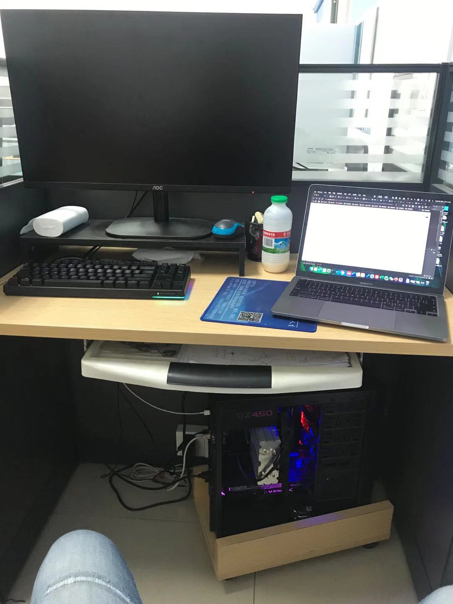
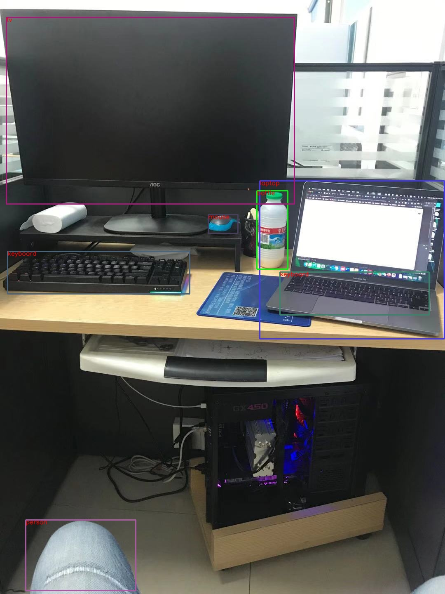
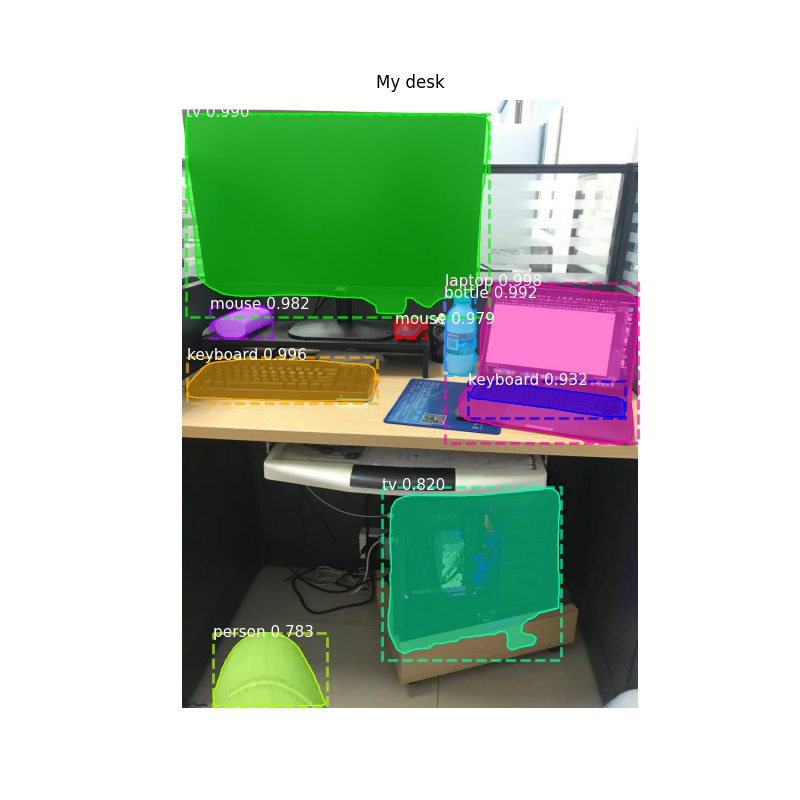

# Utils about object detection and segmentation

## 1. Faster-RCNN family
For detailed implementation tricks of the Faster-RCNN algorithm, please refer to my blog [>>here<<](https://liuzhian.github.io/2020/12/02/%E4%BB%8E%E6%BA%90%E7%A0%81%E5%AD%A6%E4%B9%A0%20Faster-RCNN/).
### 1.1 Faster-RCNN 
Modify the specified image path in `faster-rnn-demo.py` then execute it.
- Mydesk demo

### 1.2 Mask-RCNN
Modify the specified image path in `mask-rnn-demo.py` then execute it.
- Mydesk demo

