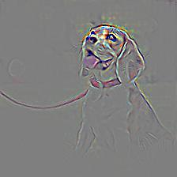
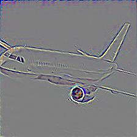

# Some NN visualization techniques
## 1. Guided propagation
Guided propagation was proposed in paper "Striving for Simplicity: The All Convolutional Net". The basic idea behind is that
during backpropagation, we can refer to the activation maps as "guide" and only care the spatial positions where make ReLU 
function get activated. That is to say, in the gradient map, we set those spatial positions which correspond to the zero activations to be zeros.

The implementation code is mostly referred from [here](https://zhuanlan.zhihu.com/p/75054200).

### 1.1 Usage
```python
from nn_vis.guided_propa import guided_propagation_resnet50

guided_propagation_resnet50("./plane.jpeg", "./plane-vis.jpeg")
```   
Currently, resnet50 is supported. You can adapt it to any model of pytorch Zoo. Take a look at the `guided_propagation_resnet50()` function.
### 1.2 Demo
- dog 

 


- plane

 


