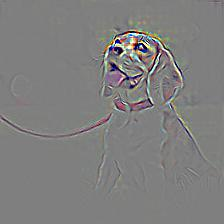
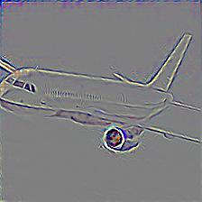
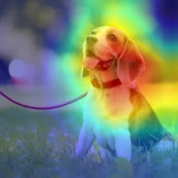

# Some NN visualization techniques

- [x] [Guided backpropagation](https://arxiv.org/abs/1412.6806)
- [x] [Grad CAM](https://arxiv.org/abs/1610.02391)

## 1. Guided backpropagation
Guided backpropagation was proposed in paper "Striving for Simplicity: The All Convolutional Net". The basic idea behind is that
during backpropagation, we can refer to the feature maps as "guidance" and only care the spatial positions where the gradient are positive. 
That is to say, in the gradient maps, we not only discard those spatial positions which correspond to negative gradient, but positions that 
didn't get activated during forward pass.

The implementation code is mostly referred from [here](https://zhuanlan.zhihu.com/p/75054200).

### 1.1 Usage
```python
from nn_vis.guided_propa import guided_propagation_resnet50

guided_propagation_resnet50("./plane.jpeg", "plane-gprop-vis.jpeg")
```   
Currently, resnet50 is supported. You can adapt it to any model of pytorch Zoo. Take a look at the `guided_propagation_resnet50()` function.
### 1.2 Demo
- dog 

 


- plane

 



## 2. Grad CAM
CAM denotes **C**lass **A**ctivation **M**ap, which tells us how sensitive is the model to a certain region. 
And Grad denotes gradient which means this method also makes use of gradient information. 
Unlike guided backpropagation, GradCAM does not using all the gradients but only a specific layer, say `layer4.2` in ResNet50. 
The basic procedures are as follows:
 - First, we compute the gradient of a specified layer with respect to classification logits(values before softmax) 
 and then apply an average pooling in every single channel of the gradient. The result can be viewed as the sensibility the model pays to each channel;
 - Then, we multiply the above sensibility to the feature maps followed by a ReLU activation, this result 
 is the heatmap we want; 
 - Finally, upscale the heatmap to the same size of input image, then we can visualize the heatmap and original image together
  to see the places where model pays attention to.   
  
The referred implementation is [here](https://github.com/kazuto1011/grad-cam-pytorch).

### 2.1 Usage
```python
from nn_vis.grad_cam import grad_cam_resnet50

grad_cam_resnet50("./dog.jpeg", "dog-gcam-vis.jpeg")
```   
Currently, `layer4.2` of `resnet50` is supported. But you can adapt it to any model you like of pytorch Zoo accordingly. 
Take a look at the `Grad_CAM` class and its `target_layer` attribute.
### 2.2 Demo
- dog 

 


- plane

 


