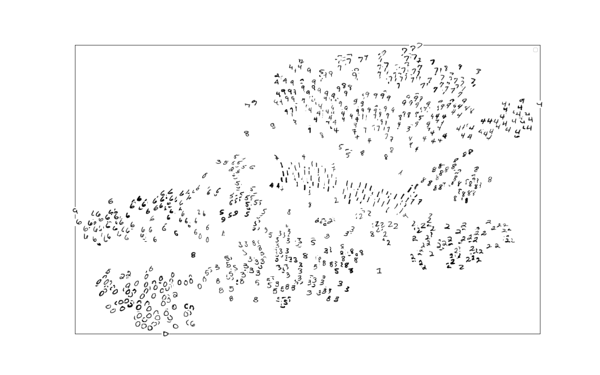
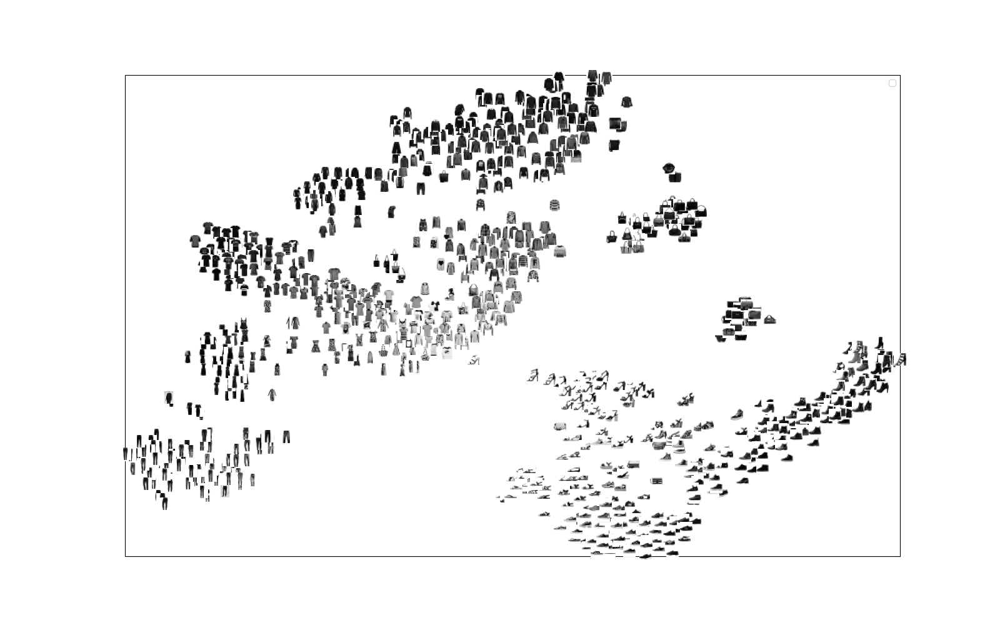

# t-SNE visualization

t-SNE is a tool to visualize high-dimensional data. It converts similarities between data points to joint probabilities and tries to minimize the Kullback-Leibler divergence between the joint probabilities of the low-dimensional embedding and the high-dimensional data.

This project provides some utility functions to apply the t-SNE algorithm implemented in scikit-learn to some PyTorch built-in dataset, e.g., `MNIST` and `FashionMNIST`. So you have to install the sklearn and PyTorch first.

### Quick start
```python
python t_SNE.py 
```
By default, the `FashionMNIST` is used and the visualization type is set to `image_scatter`. You can play with `MNIST` and use the `point_scatter` visualization style instead, which correspond to [#L221](./t_SNE.py#L221) and [#L230](./t_SNE.py#L230), respectively. 

### Result
- MNIST

- FashionMNIST



### Notice
Currently, the `MNIST` and `FashionMNIST` datasets are supported. And I just simply flatten the spatial dimensions out (i.e., H and W) for an image array. For compact features extracting, one can consider to use neural networks to get semantic features first, and use that to feed t-SNE. 