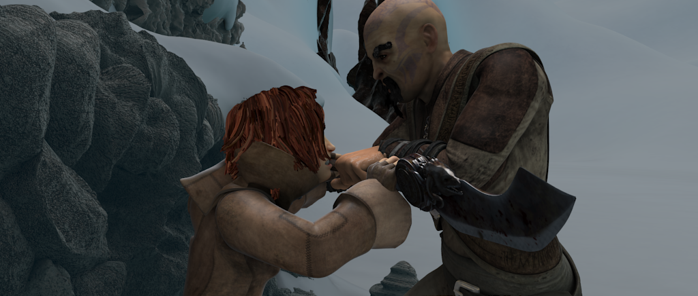
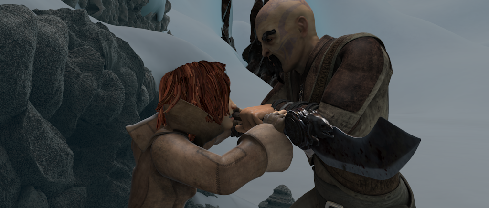
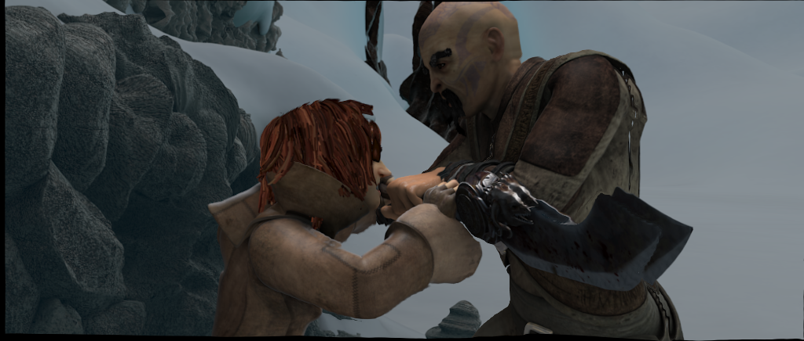

# Pytorch implementation about optical flow warping
Reference:
- [hunters0813's post](https://discuss.pytorch.org/t/how-to-warp-the-image-with-optical-flow-and-grid-sample/71531/2)
- [grid_sample doc](https://pytorch.org/docs/stable/nn.functional.html#grid-sample)

## Usage
```python
import cv2
from warping.warp import visulize_flow_file, optical_flow_warping
import torch
import os

base_dir = os.path.dirname(__file__)

# visualize the optical flow here
visulize_flow_file(os.path.join(base_dir, 'reference_frame_0010.flo'))

test = cv2.readOpticalFlow(os.path.join(base_dir, 'reference_frame_0010.flo'))
test = torch.from_numpy(test)
H, W, C = test.shape
test = test.permute(2, 0, 1).unsqueeze(0)

test_img2 = cv2.imread(os.path.join(base_dir, 'frame_0011.png'))[:, :, ::-1]
test_img2 = test_img2 / 255.0
test_img2 = torch.from_numpy(test_img2).float()
test_img2 = test_img2.permute(2, 0, 1).unsqueeze(0)

out = optical_flow_warping(test_img2, test)[0]
out = out.permute(1, 2, 0).numpy()
# plt.imshow(out)
# plt.show()
cv2.imwrite(os.path.join(base_dir, 'warped.png'), out[:, :, ::-1] * 255)
```
## Visualize
- img1

- img2

- optical flow

- warped result


There exist some artifacts in the warped image. This is because the optical flow is not estimated optimally.